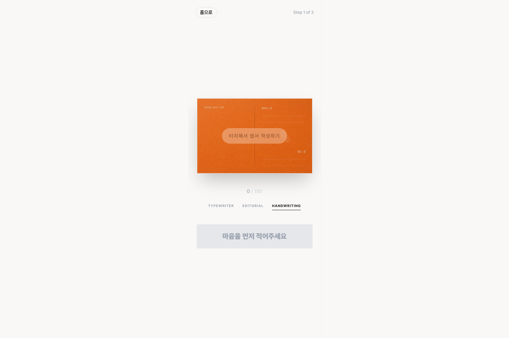

# Orange Postcard MVP

온라인에서 짧은 메시지를 작성하면 실제 종이 엽서로 전달되는 경험을 검증하기 위해 만든 MVP입니다.

- Live: <https://orangepostcard.vercel.app/>

## 만든 이유

엽서는 짧은 문장과 물성이 함께 남는 매체이지만, 실제로 보내려면 엽서 구매, 주소 확인, 우표 구매, 우체통 발송처럼 작은 절차가 많습니다. 저는 이 번거로움을 줄이면 사람들이 다시 엽서를 보내고 싶어 하는지 확인하고 싶었습니다.

핵심 질문은 하나였습니다.

> 발송 과정의 번거로움을 줄이면, 사람들이 온라인에서도 종이 엽서의 진정성을 느끼고 보내려 할까?

## 해결 방식

처음부터 물류까지 갖춘 완성 서비스를 만들기보다, 사용자가 실제로 엽서를 보내고 싶어 하는지 확인하는 흐름을 먼저 만들었습니다.

1. 랜딩 페이지에서 엽서 발송의 상황과 가치를 보여줍니다.
2. 사용자가 엽서 문구를 직접 작성합니다.
3. 배송에 필요한 정보를 입력합니다.
4. 마지막 결제 직전 단계까지 도달하는지를 측정합니다.

이 흐름을 통해 단순 클릭이 아니라, 실제 발송 의향에 가까운 행동을 확인하려 했습니다.

## 제가 한 일

- 문제 정의와 타깃 가설 수립
- 랜딩 페이지 카피, 비주얼 방향, 모바일 우선 작성 흐름 설계
- 엽서 작성 화면, 단계별 입력 흐름, 작은 모션 구현
- Google Tag Manager와 Vercel Analytics 기반 이벤트 설계
- 결제 의향 전환 기준 정의 및 MVP 테스트 진행

## 검증 결과

MVP 테스트에서 최종 결제 의향 단계 기준 **6% 전환율**을 확인했습니다. 이 수치는 완성된 사업 성과가 아니라, 제가 느낀 엽서의 가치가 온라인 서비스 흐름 안에서도 다른 사람에게 전달될 수 있는지 확인한 초기 신호로 보았습니다.

## 기술 구성

- HTML, CSS, JavaScript
- Tailwind CDN
- Google Tag Manager
- Vercel Analytics
- Supabase client 실험
- Vercel 배포

## 현재 범위

이 저장소는 실제 물류 운영까지 포함한 완성 서비스가 아니라, 문제 정의와 사용자 의향을 검증하기 위한 MVP입니다. 심사자는 이 프로젝트를 제품 가설을 세우고, 사용자 흐름을 만들고, 데이터를 통해 가능성을 확인한 사례로 봐주시면 좋겠습니다.
